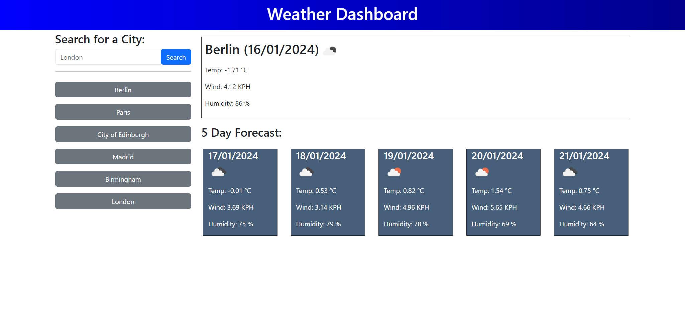

# Weather Dashboard

A weather app that allows you to see the current and 5-day weather forecast for your favourite cities.

The app uses weather data provided by [OpenWeather API](https://openweathermap.org/), JavaScript/jQuery for logic, localStorage to save the search history and displayed responsively using the [Bootstrap](https://getbootstrap.com/) framework.

It is deployed at the following URL:

https://willmowlam.github.io/nebulus-weather-dashboard/

## Features

- Search location by name
- Modal to narrow a search
- Display current weather
- Display 5-day weather forecast
- Save up to 6 searches (configurable in script.js)

## Screenshot

